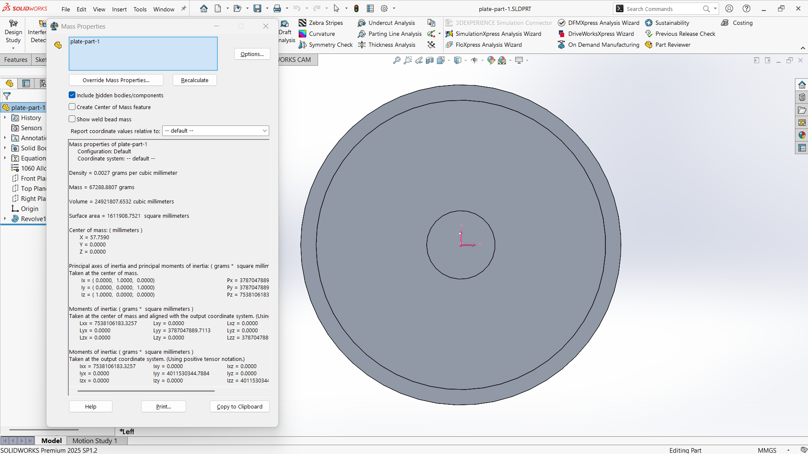
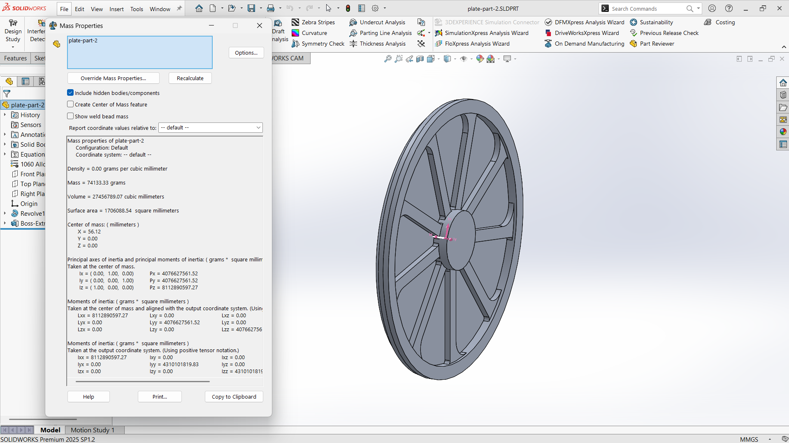
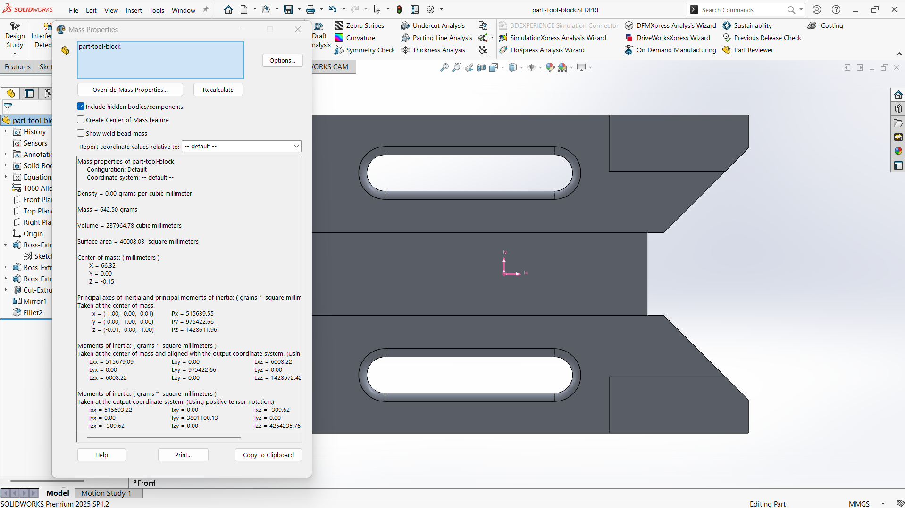
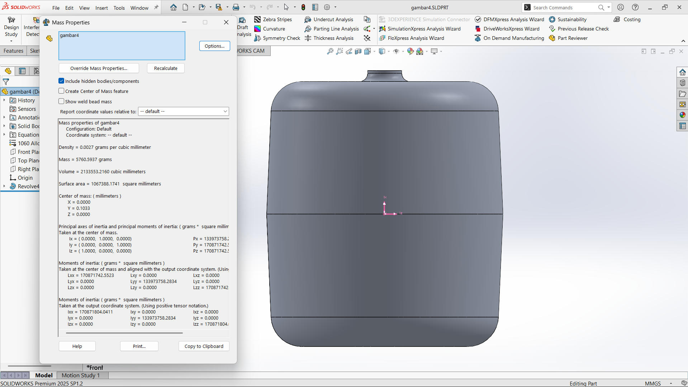
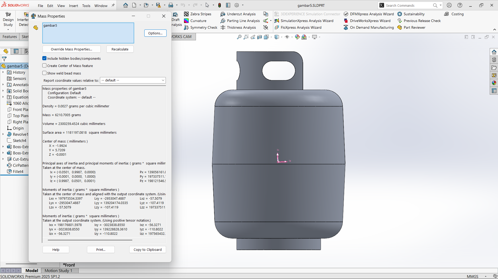
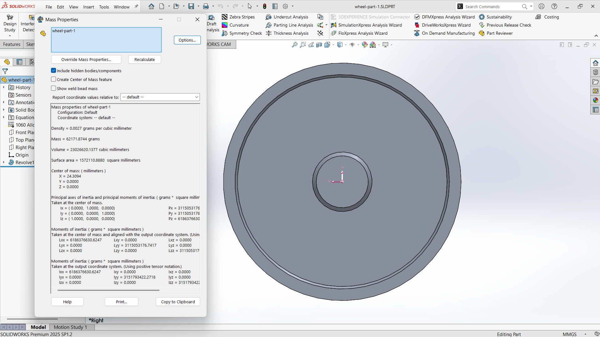
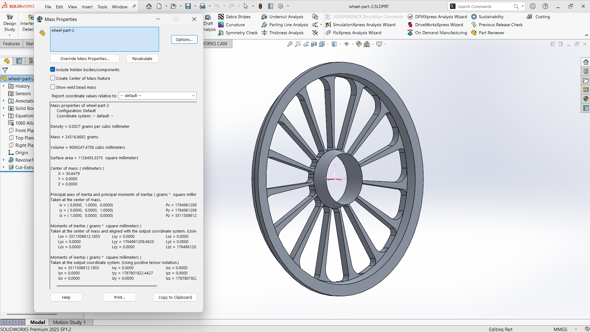
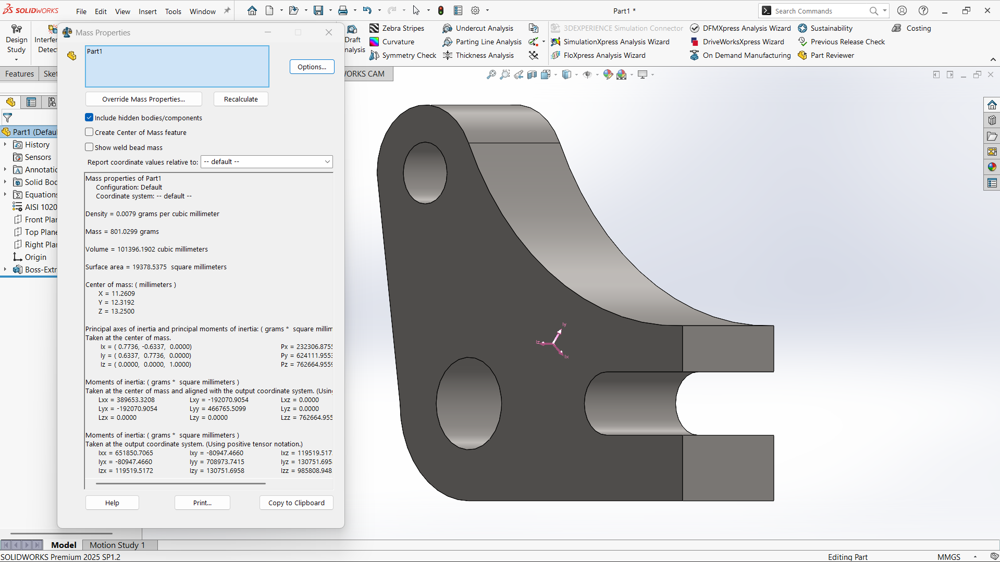
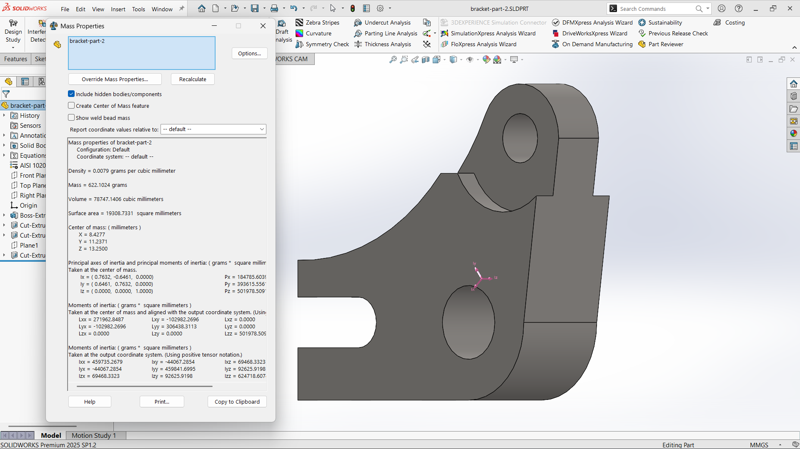
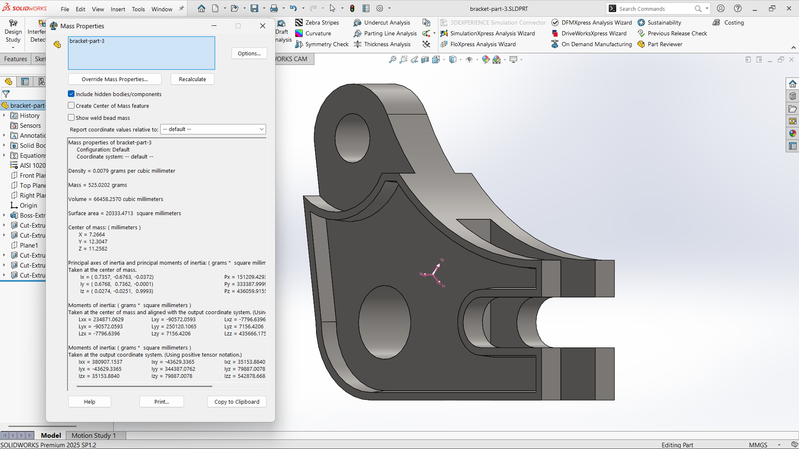

# Modul 4 Praktikum CAD-CAM

## Identitas Mahasiswa
- **Nama:** Reinhart Barus  
- **NIM:** 40040325650081  
- **Program Studi:** S.Tr. Teknologi Rekayasa Otomasi  
- **Departemen:** Teknologi Industri  
- Sekolah Vokasi  
- Universitas Diponegoro  

---

## Dosen Pengampu
- **Megarini Hersaputri, S.T., M.T.**  
- **Rofiq Cahyo Prayogo, S.T., M.T.**  

---

## Lampiran

### 1. Part Plate

#### Plate Part 1

- **Density:** 0.0027 grams per cubic milimeter
- **Mass:** 67288.8807 grams

#### Plate Part 2

- **Density:** 0.0027 grams per cubic milimeter
- **Mass:** 74133.33 grams

### 2. Part Tool Block

#### Tool Block

- **Density:** 0.0027 grams per cubic milimeter
- **Mass:** 642,50 grams

### 3. Part Tank

#### Tank Part 1

- **Density:** 0.0027 grams per cubic milimeter
- **Mass:** 5760.5937 grams

#### Tank Part 2

- **Density:** 0.0027 grams per cubic milimeter
- **Mass:** 6210.7005 grams

### 4. Part Wheel

#### Wheel Part 1

- **Density:** 0.0027 grams per cubic milimeter
- **Mass:** 62171.8744 grams

#### Wheel Part 2

- **Density:** 0.0027 grams per cubic milimeter
- **Mass:** 24316.8682 grams

### 5. Part Bracket

#### Bracket Part 1

- **Density:** 0.0027 grams per cubic milimeter
- **Mass:** 801.0299 grams

#### Bracket Part 2

- **Density:** 0.0027 grams per cubic milimeter
- **Mass:** 622.1024 grams

#### Bracket Part 3

- **Density:** 0.0027 grams per cubic milimeter
- **Mass:** 525.0202 grams