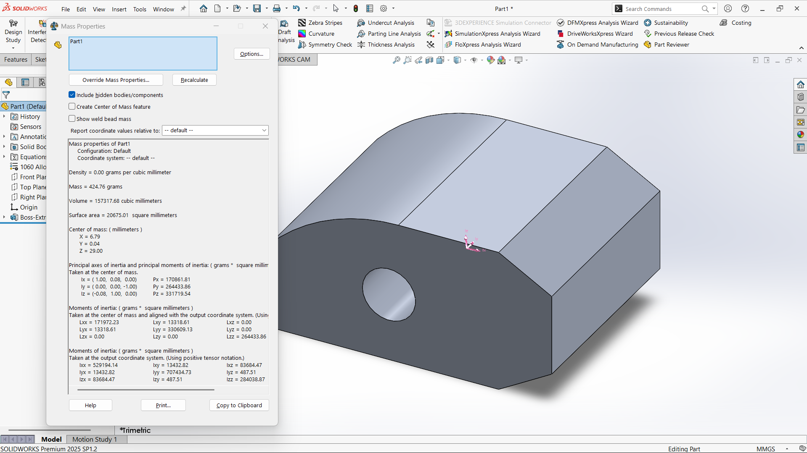
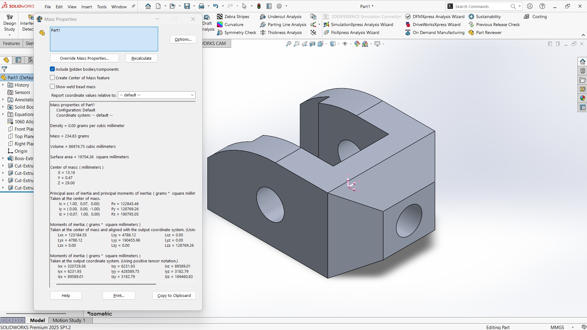
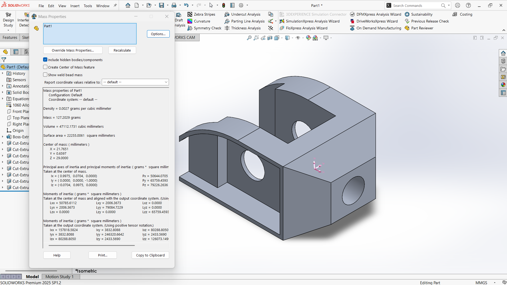
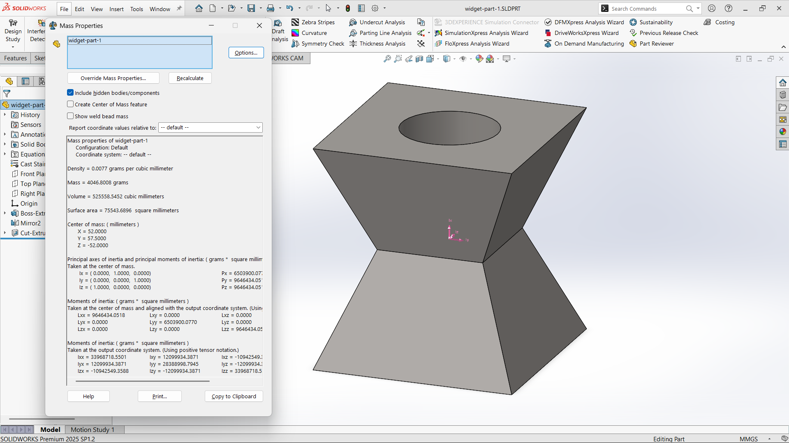
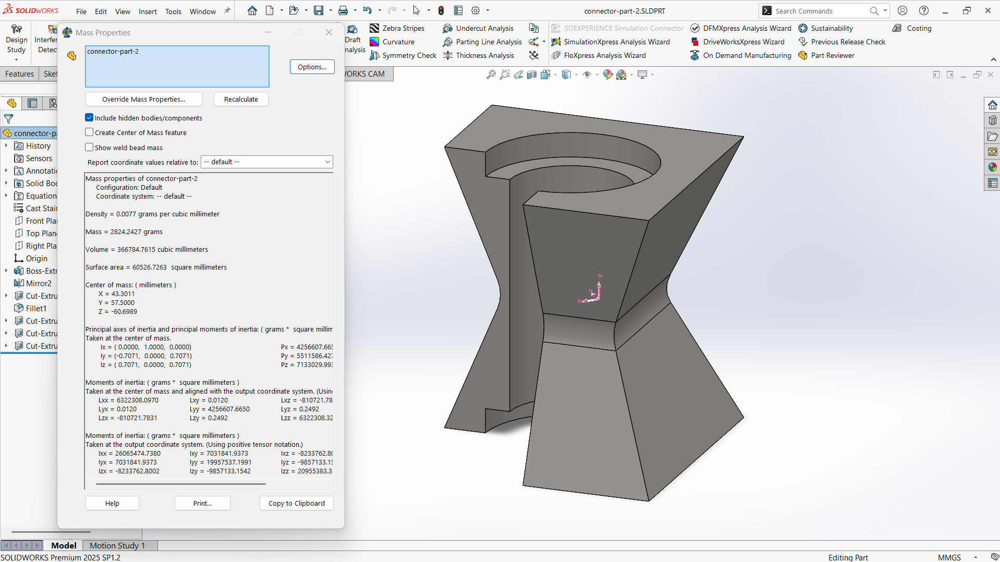
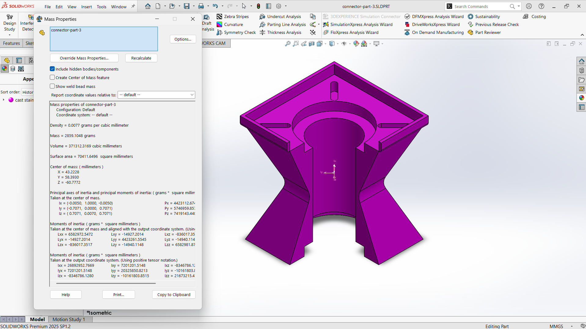

# Modul 5 Praktikum CAD-CAM

## Identitas Mahasiswa
- **Nama:** Reinhart Barus  
- **NIM:** 40040325650081  
- **Program Studi:** S.Tr. Teknologi Rekayasa Otomasi  
- **Departemen:** Teknologi Industri  
- Sekolah Vokasi  
- Universitas Diponegoro  

---

## Dosen Pengampu
- **Megarini Hersaputri, S.T., M.T.**  
- **Rofiq Cahyo Prayogo, S.T., M.T.**  

---

## Lampiran

### 1. Widget

#### Widget Part 1

- **Density:** 0.0027 grams per cubic milimeter
- **Mass:** 424.76 grams

#### Widget Part 2

- **Density:** 0.0027 grams per cubic milimeter
- **Mass:** 234.83 grams

#### Widget Part 3

- **Density:** 0.0027 grams per cubic milimeter
- **Mass:** 127.2029 grams

### 2. Connector

#### Connector Part 1

- **Density:** 0.0077 grams per cubic milimeter
- **Mass:** 4046.8008 grams

#### Connector Part 2

- **Density:** 0.0077 grams per cubic milimeter
- **Mass:** 2824.2427 grams

#### Connector Part 3

- **Density:** 0.0077 grams per cubic milimeter
- **Mass:** 2859.1048 grams