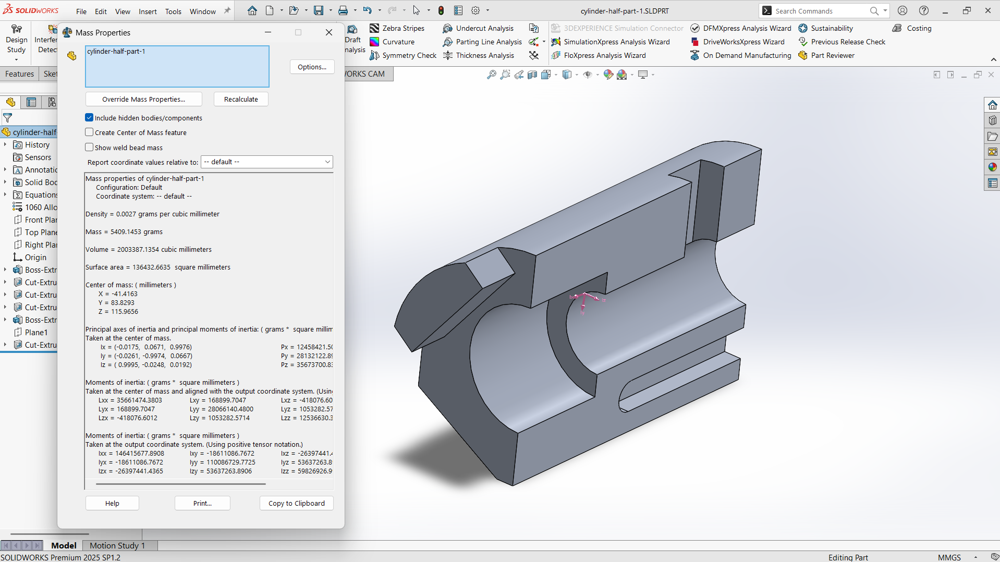
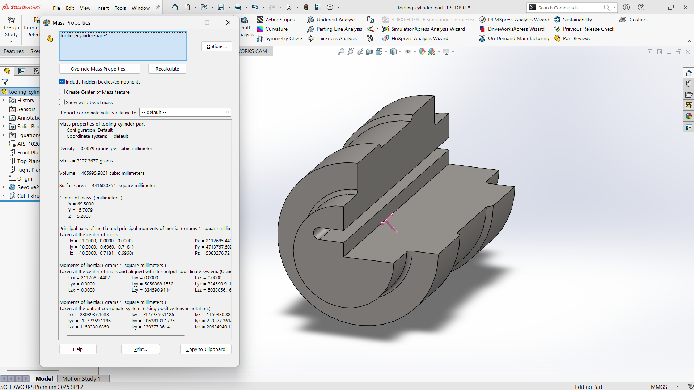
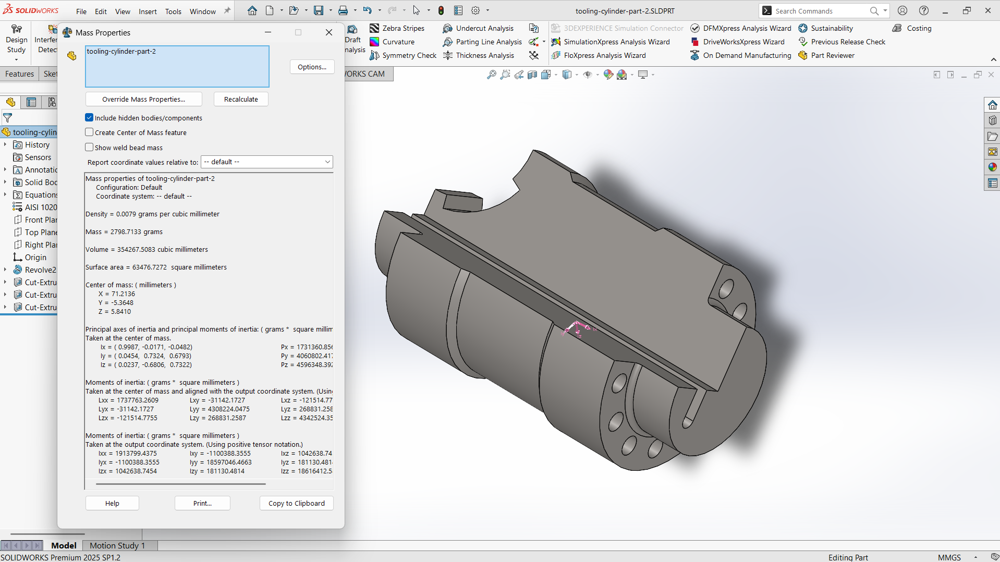
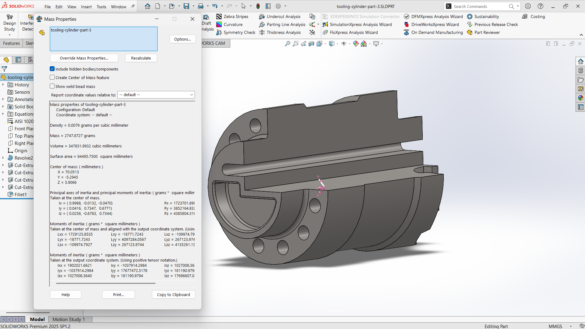

# Modul 6 Praktikum CAD-CAM

## Identitas Mahasiswa
- **Nama:** Reinhart Barus  
- **NIM:** 40040325650081  
- **Program Studi:** S.Tr. Teknologi Rekayasa Otomasi  
- **Departemen:** Teknologi Industri  
- Sekolah Vokasi  
- Universitas Diponegoro  

---

## Dosen Pengampu
- **Megarini Hersaputri, S.T., M.T.**  
- **Rofiq Cahyo Prayogo, S.T., M.T.**  

---

## Lampiran

### 1. Hydrolic Cylinder Half

#### Hydrolic Cylinder Half Part 1

- **Density:** 0.0027 grams per cubic milimeter
- **Mass:** 5409.15 grams

#### Hydrolic Cylinder Half Part 2

- **Density:** xxx
- **Mass:** xxx

### 2. Cylinder Jig

#### Cylinder Jig Part 1

- **Density:** xxx
- **Mass:** xxx

#### Cylinder Jig Part 2

- **Density:** xxx
- **Mass:** xxx

### 3. Tooling Cylinder

#### Tooling Cylinder Part 1

- **Density:** 0.0079 grams per cubic milimeter
- **Mass:** 3207.3677 grams

#### Tooling Cylinder Part 2

- **Density:** 0.0079 grams per cubic milimeter
- **Mass:** 2798.7133 grams

#### Tooling Cylinder Part 3

- **Density:** 0.0079 grams per cubic milimeter
- **Mass:** 2747.8727 grams